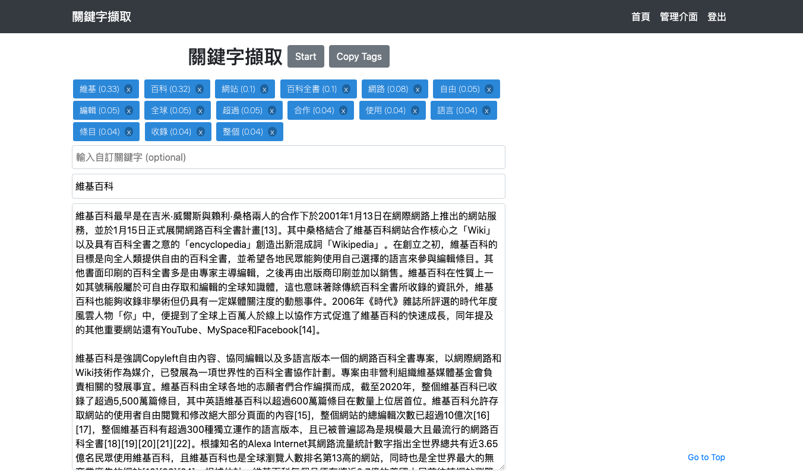

# Django Extract Keyword


This is a Python Django website for Chinese article keyword extraction.
This project is done at [Taiwan AI Academy](https://en.aiacademy.tw/).

[Demo Site](https://serene-stream-44779.herokuapp.com/)

## Local Test
Make sure you have Python [installed properly](http://install.python-guide.org). 

```sh
$ git clone https://github.com/henrywang1/django_extract_keyword.git
$ cd django_extract_keyword

$ pipenv install
$ python manage.py migrate
$ python manage.py collectstatic
$ python manage.py run server
```

## Features
1. Extract article keywords
2. Check Google Trend, and list related words
3. Django based user interface
4. Support user defined keyword and stop word
